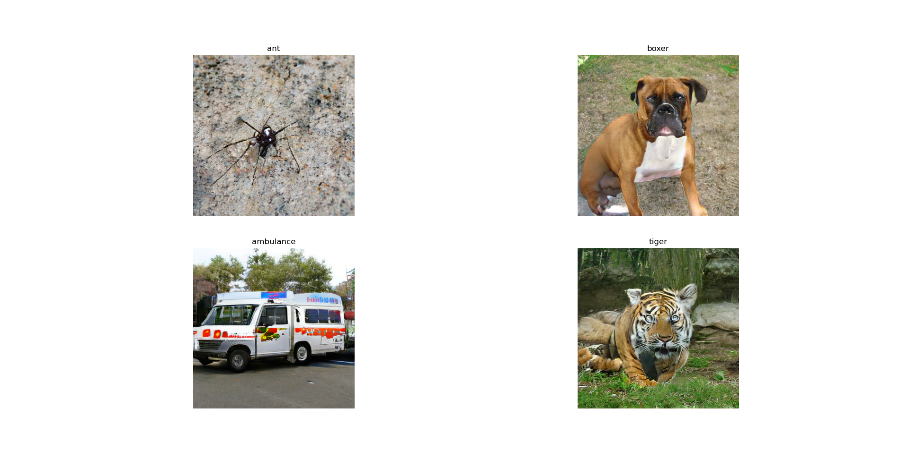
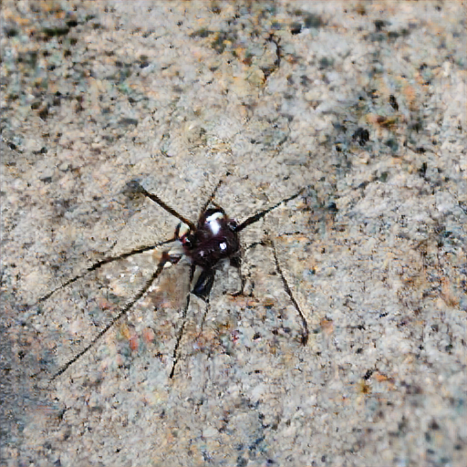
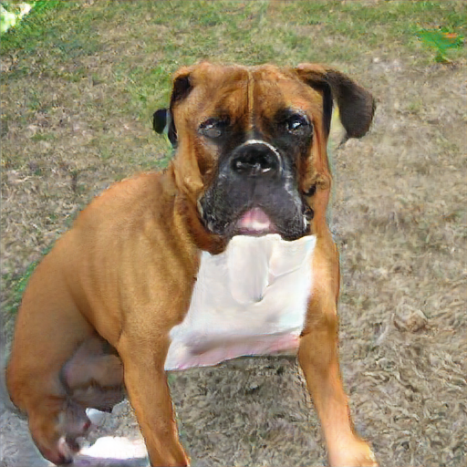
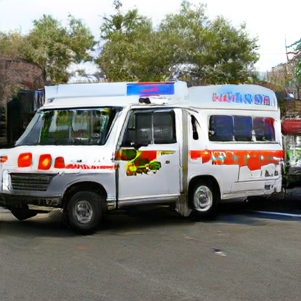
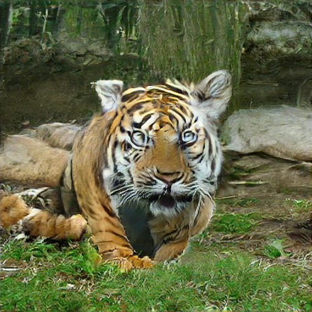

# BigGAN.
A Pytorch reimplementation of DeepMind's [BigGAN](https://www.deepmind.com/open-source/big-gan) model using its pretrained weights.
This project is largely thanks to [huggingface](https://github.com/huggingface).

The requirements can be downloaded using the following command:

```
pip3 install -r requirements.txt`
```

The list of classes to try can be found in [here](https://gist.github.com/yrevar/942d3a0ac09ec9e5eb3a), which is part of the imagenet1000 model.

You can try different model trained on image sizes 128, 256 as well.
```
model = BigGAN.from_pretrained('biggan-deep-128')
```
```
model = BigGAN.from_pretrained('biggan-deep-256')
```

## My Input Classes:
```
['ant', 'boxer', 'ambulance', 'tiger']
```
## Output:


### Ant

### Boxer

### Ambulance

### Tiger


## References:

- *https://github.com/huggingface/pytorch-pretrained-BigGAN*
- *https://www.deepmind.com/open-source/big-gan*
- *https://gist.github.com/yrevar/942d3a0ac09ec9e5eb3a*
